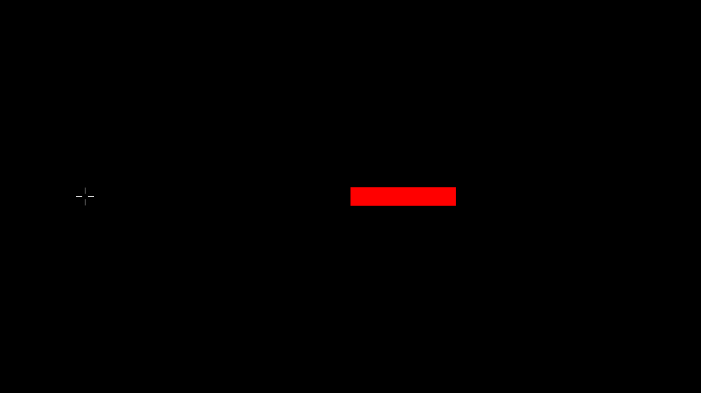

==============
Aimed Movement
==============

Tests subjects reaction time by asking them to move the mouse cursor from a
starting point to sequentially presented rectangles. The rectangles will have
a shuffled size and distance from the starting point.
