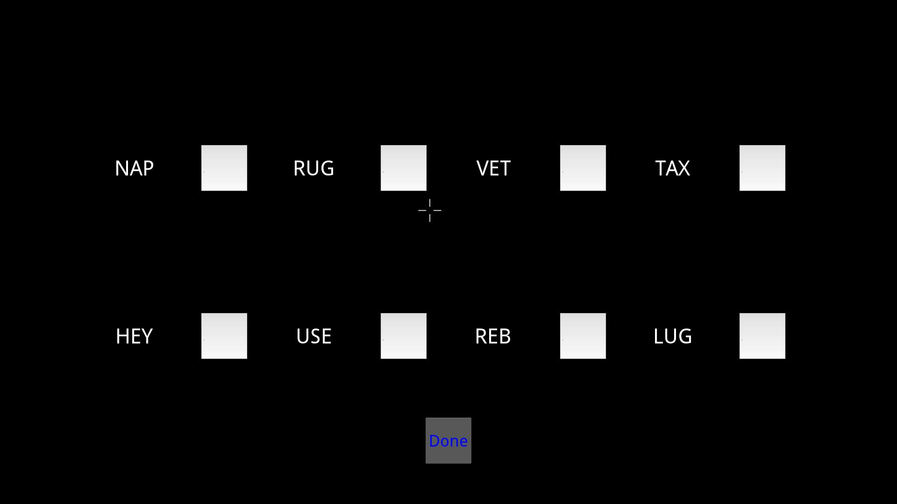

==========
Ebbinghaus
==========

This is a short (5-10 minutes) experiment replicated some of the basic
elements of Ebbinghaus's famous self administered memory experiments. It gives
a lists of CVC words(nonsense or normal words) repeatedly presented until the
participant gets them correct twice, then moves on to a new list. After the
study phase, it then repeat the same lists, to allow ' savings" to be
computed.

