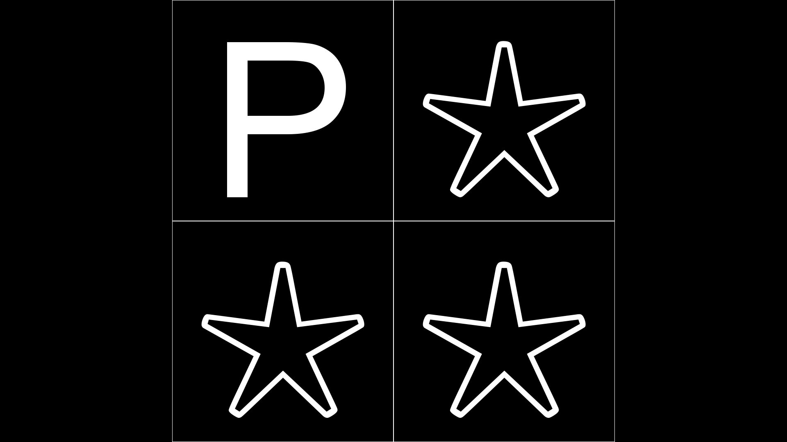

=========
Go, No Go
=========

This experiment tests people reaction time as well as their ability to inhibit
their need to press the go button. Depending on the stimulus, they hit or
don't hit a go button.

This experiment shows how to effectively use the **UntilDone**, **Subroutine**,
**Parallel**, and **Serial** states.
