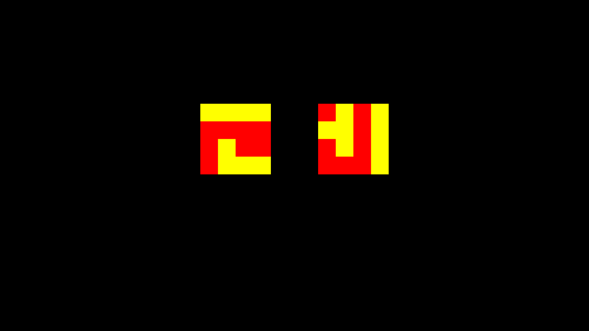

===============
Match To Sample
===============

Show a matrix of squares at the center of the screen. The participant needs to
pick, out of 2 newly displayed matricies, which matrix is a repeat of the one
shown before.

This experiment shows how to effectively define a **Subroutine** state. It also
shows how to use the **Parallel** and **Loop** Flow states as well as the
**Rectangle** and **Label** Ation states.
