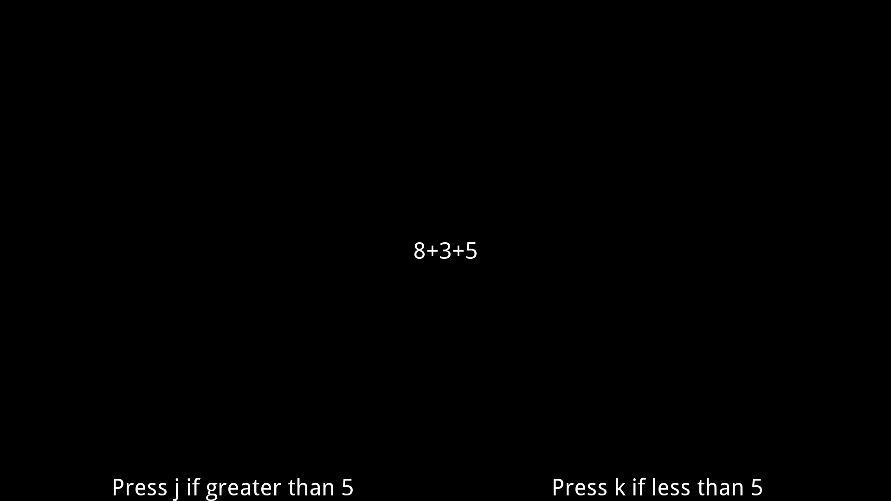

===============
Math Processing
===============

This experiment shows the participant mathmatical statement and then asks them
to identify whether the statement evaluates to greater than or less than 5.

This experiment shows how to effectively use the Flow states **Parallel**,
**UntilDone**, and **Loop** while also showing off how to display text onto the
screen with the Action state **Label**.
