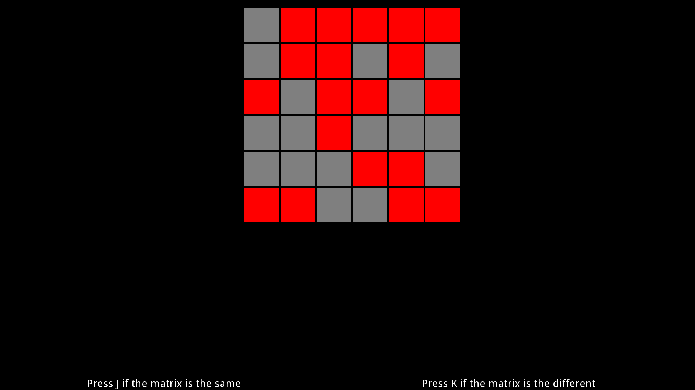

===============
Matrix Rotation
===============

Subjects will view a matrix of squares of different colors, then they will view
either the same matrix, rotated 90 degrees, or a similar matrix rotated 90
degrees. Then the participant will determine whether or not the two presented
matricies were the same or different.

This experiment shows how to effectively use the Flow states **Parallel**, **Loop**,
**Wait**, and **UntilDone**. This experiment also shows how best to display a
rectangle onto the screen with a **Rectangle** state. It will also demonstrate
that no matter how complicated the trial generation is, you can still have
SMILE code that isn't that complicated.
